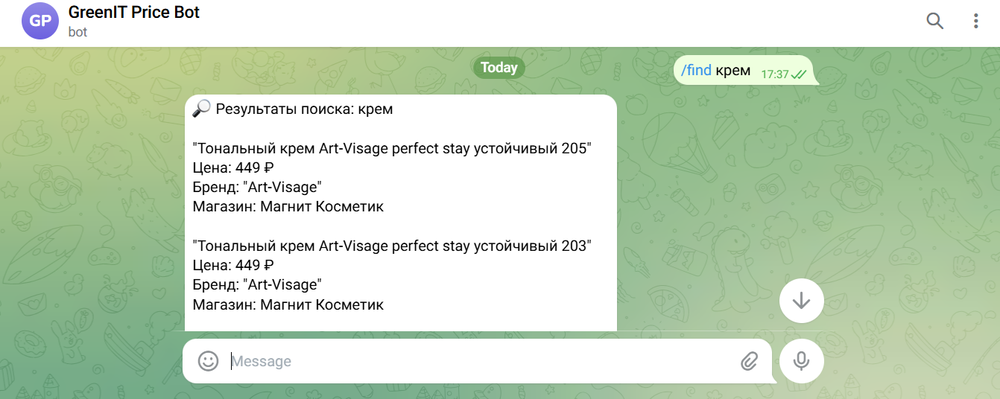
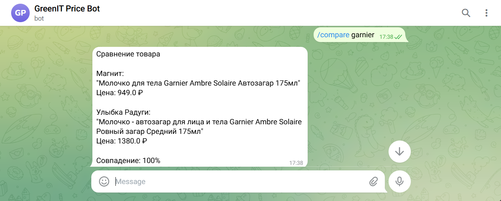
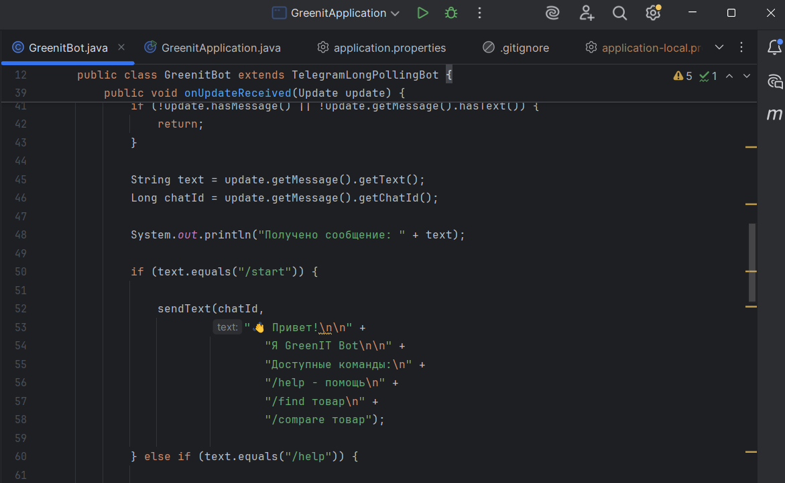

# GreenIT Price Bot

Telegram-бот для поиска и сравнения цен товаров между магазинами
«Магнит Косметик» и «Улыбка Радуги».

## О проекте

Проект автоматически собирает данные с сайтов магазинов,
сохраняет их в CSV и предоставляет пользователю поиск и
сравнение цен через Telegram-бота.

## Стек технологий

- Java 21
- Spring Boot
- PostgreSQL
- Telegram Bot API
- Maven

## Функциональность

- Парсинг товаров с сайтов магазинов
- Сохранение данных в CSV
- Поиск товаров по названию
- Сравнение цен между магазинами
- Автоматический матчинг похожих товаров
- Telegram-интерфейс для пользователей

## Архитектура

Парсер → CSV → Product Matching → Telegram Bot

## Демонстрация

Видео работы проекта:
[(ссылка на видео)](https://disk.yandex.ru/i/zotzqH8ZZVv_zQ)

## Скриншоты

### Поиск товара

### Сравнение цен

### Главный экран

## Планы развития

- Хранение данных в PostgreSQL
- Поддержка новых магазинов
- Telegram-уведомления о снижении цены
- Планировщик автоматического обновления цен
